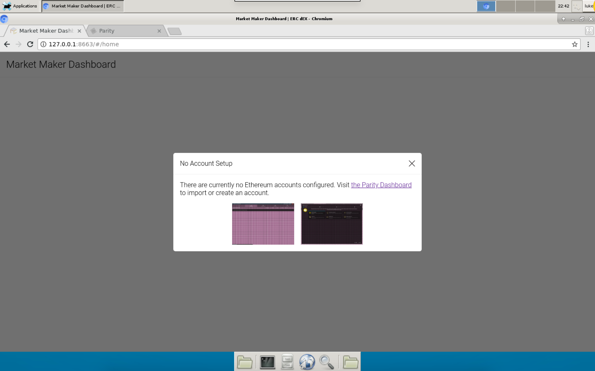
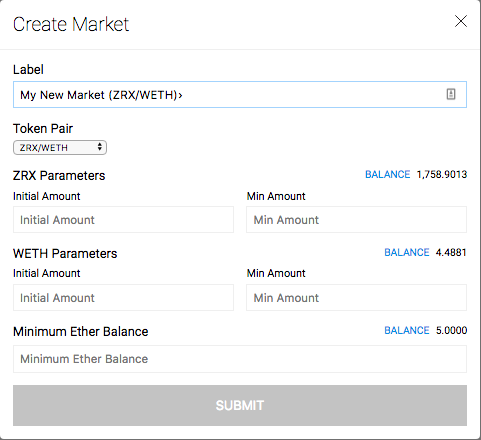
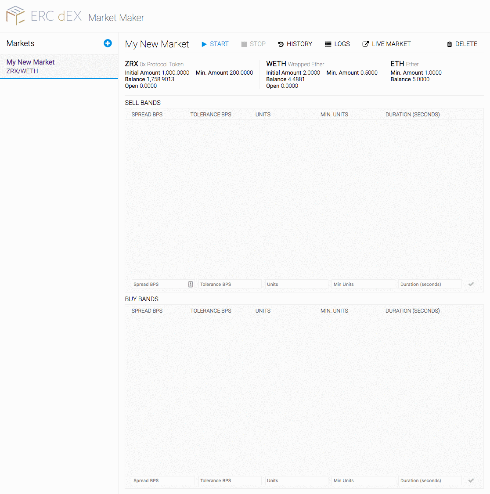
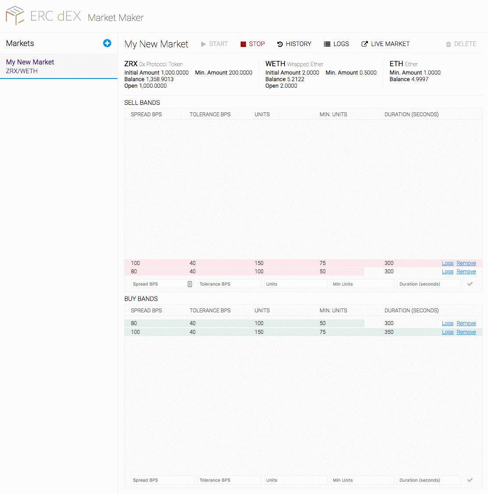

# Overview

The ERC dEX Automation Toolkit allows traders to create custom trading strategies that will be executed autonomously. Using the dashboard (or a scripting language of your choice, described below), the user creates **Markets** (e.g. ZRX/WETH), then adds **Bands** to that market that specify desired price spreads. When a **Market** is active, **Bands** will deploy and cancel ERC dEX **Orders** in accordance with the user defined strategy.

# Installation

## System Requirements
- The application uses `docker-compose` to run all services (local web dashboard, APIs, and a local Parity Ethereum node). Docker-compose can be installed on any MacOS, Windows, or Linux machine. Follow the instructions at https://docs.docker.com/compose/install to install docker-compose on your platform.
    - There are [known issues](https://github.com/docker/for-mac/issues/1374) when running on some versions of Docker for Mac. External network calls may fail after the application has been running for several hours. Restarting the Docker Daemon should return service.
- `docker-compose` requires `docker`. For most use cases, choose Docker CE edition, not Docker EE.
- Download the latest version from [Releases](https://github.com/ERCdEX/automated-market-maker/releases) and unpack the .zip in a location of your choice
- Alternatively, run from source by cloning the repository
- Hardware
    - You will want to run this application on a SSD (Solid State Drive). The underlying ethereum node may be slow on a mechanical drive.
    - Allow significant disk space (current recommendation: 50 GB)

# Configuration

## Starting the application

- Start process
  - mainnet: `sh run-mainnet.sh` or `sudo sh run-mainnet.sh`
  - kovan (testnet): `sh run-kovan.sh` or `sudo sh run-kovan.sh`
- Once the environment bootstrapping process is complete, visit http://localhost:8663 to view the dashboard

## Importing Ethereum Wallet

In order to create new markets, an Ethereum account must be linked. When first visiting the dashboard, you should be presented to a prompt to import an account:

# Concepts

A **Market** describes a persistent configuration that facilates the buying and selling of a token pair. An example of a market is "ZRX/WETH", which means that ZRX is being bought and sold in exchange for WETH. A market is created with parameters that describe the range and amount of assets that are available for trading. At a high level, a **Market** is responsible for maintaining a trader's overall desired position in the market as prices change.

A **Band** belongs to a **Market** - a **Market** can have multiple bands. A band specifies a price spread and some constraints on how much of an asset should be traded within that band. **Bands** are responsible for deploying **Orders**, and a **Band** can contain multiple **Orders** at a given time.

An **Order** represents a signed and deployed ERC dEX order. **Orders** can move between bands in response to price action. If an **Order** moves out of the specified price range of any band, it may be canceled.

# Architecture and Design Considerations

Automated trading for decentralized platforms presents unique challenges not seen in traditional, centralized changes. Trading tools for decentralized applications have to be designed in a way that acknowledges these challenges and optimizes around them. Below, we'll describe some of the challenges of decentralized platforms and how we handle those issues with the toolkit.

## Signing Requirements

Unlike centralized exchanges, which expose simple, centralized endpoints for order creation and cancelation, decentralized exchanges depend on off-chain signing and sending transactions to the Ethereum blockchain as the primary way to authorize actions. As a result, any decentralized trading system requires a local wallet implementation that supports signing.

The toolkit includes a bundled, pre-configured version of [Parity](https://www.parity.io/), a robust, fully featured Ethereum client which supports signing. The toolkit requires that a wallet be unlocked, enabling 'headless' operation.

## Cancelation Gas Costs

ERC dEX is built using the [0x Protocol](https://www.0xproject.com/), a protocol enabling trustless, decentralized exchange of ERC20 tokens.

While **creation of Orders is free of gas costs**, order cancelations *do* have to be submitted to the blockchain, incurring gas costs. Since most market making strategies involve cancelation of up to 90% of all orders (or in some cases, more), gas costs can be prohibitively expensive if not accounted for.

With this in mind, the toolkit is designed to optimize for **keeping gas costs as low as possible**. With a few guidelines, we've found that cancelation gas costs are usually negligible:

- Short duration orders mean that most orders will expire naturally before needing to be canceled; the toolkit requires order expiration to be set at least 5 minutes, but no longer that 20 minutes. Expired orders are automatically recreated at the updated price.
- **Bands**, when created, require a specification for spread (in BPS) and tolerance (in BPS). The spread specifies the spread from the current market midpoint price, while the tolerance specifies how far from that price the market can move before the order is considered "out of band". Example: The price is 100. A buy band at 100 BPS puts the order price at 99, and a tolerance of 20 BPS allows price action that would put an order price between 98.8 and 99.2. 10 BPS would allow an order price between 98.9 and 99.1. By include this concept of tolerance, bands can be given some 'wiggle room' to account for price action
- Multiple bands can be created on both buy and sell side. By giving each of these bands tolerance such that bands "overlap" (100 bps with 10 bps tolerance = 98.9 - 99.1, 120 bps with 10 bps tolerance = 98.7-98.9), orders can move freely between bands rather than being canceled and recreated
- The core engine creates logs to monitor gas usage which can be analyzed programatically or via the UI Dashboard

## Programmatic Band Management

While the UI Dashboard is a novel and useful way of manually managing bands, it requires a person to man the dashboard and make adjustments based on price action or other feedback mechanisms. This aligns with some but not all trading strategies.

The toolkit supports programmatic band management via a local REST API which can be used with the included [JS client](./web/src/api/api.ts) or by calling the API from a client of your choice. Users may then manage bands via some custom/external source of feedback. This allows automated trading in a trustless, non-custodial context while abstract away the complexities of blockchain interaction.

# Usage

## Dashboard

### Markets

When you first begin, you'll need to create a new market.

- **Label**: Unique Identifier of the Market
- **Token Pair**: Assets being traded
- **Parameters**
    - **Initial Amount**: This is the initial amount available for trading. Orders will be allocated to match this amount **or** the available token balance, whichever is higher.
    - **Minimum Amount**: This is the minimum amount of an asset that should be reserved. If the asset amount dips below this amount, the market will be paused and will require intervention from a market operator.
    - **Minimum Ether Amount**: This is the minimum amount of Ether that should be contained in the account at any time. If the available about dips below this amount, the market will be paused and will require intervention from a market operator.

### Bands

By default, a market will have no bands; the first step in actually deploying a market is to create bands that specify desirable positions.

- **Spread BPS**: The spread is defined as the different between the market price on a side (buy or sell) and the midpoint price or market price. 1 bp (basis point) = .1% = .0001
- **Tolerance BPS**: The tolerance specifies how far in BPS the market price can move before an order is considered out of band
- **Units** Units represents how much a band consumes of the Total Market Commitment (TMC). A **Unit** is not related in any way to a token unit (e.g. 200 ZRX) - units are purely relative.
- **Mininum Units** Minimum unit commitment for a particular band; if deployed orders are filled below this amount, additional orders will be created to keep the band fully committed
- **Duration** Expiration period of deployed orders in seconds. Limited to 300-1200 seconds (5-20 minutes).

### Starting/Stopping

By default, a market is in the "stopped" state, meaning that orders are not being deployed. To begin order deployment and automated position maintenance, click the "Start" button. Verify that the orders have been created by viewing the market in ERC dEX or by viewing band logs:

To stop a market, click the "Stop Market" button. If there are deployed orders, the user should decide whether to cancel them immediately or to allow them to expire.

Markets can be deleted with the "Delete" button; the Market must be stopped before deletion is possible.
