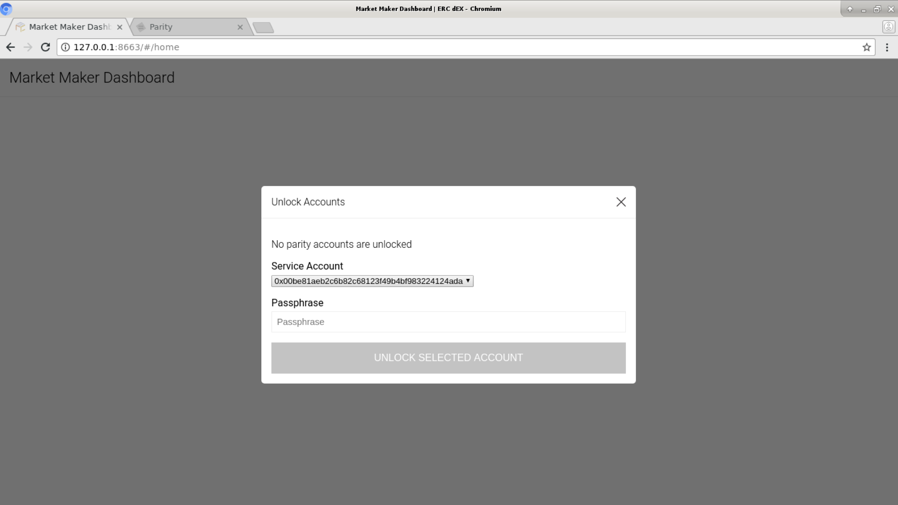
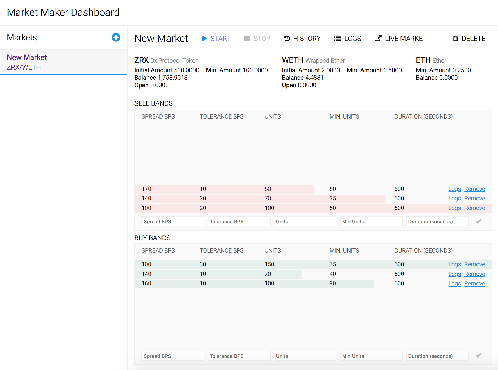

# Overview

TODO

# Installation

## System Requirements
- The application uses `docker-compose` to run all services (local web dashboard, APIs, and a local Parity Ethereum node). Docker-compose can be installed on any MacOS, Windows, or Linux machine. Follow the instructions at https://docs.docker.com/compose/install to install docker-compose on your platform.
- `docker-compose` requires `docker`. For most use cases, choose Docker CE edition, not Docker EE.
- Download the application from 'Releases' (TODO: Have a page and a link for this) and unpack the .zip in a location of your choice
    - Alternatively, `https://github.com/ERCdEX/aqueduct-market-maker.git` if you have git installed

# Configuration

Configuration consists of a few basic steps:
- Defining environment variables
- Starting the application
- Creating/importing wallet(s)
- Unlocking wallet(s)

## Defining Environment Variables

The application reads from a .env file at the root of the project or environment variables can set at the system level. A sample .env file is provided [here](./.env-EXAMPLE). There are two required variables:

- ETHEREUM_CHAIN: this can be either 'kovan' (testnet) or 'foundation' (mainnet)
- AQUEDUCT_API_KEY_ID: This is your public API key ID for Aqueduct. Visit [here](https://github.com/ERCdEX/aqueduct/tree/master/guides#general-guidelines) for information on how to sign up for an API key.

## Starting the application

- Run `docker-compose up --build` (probably `sudo docker-compose up --build` on Linux) from the root directory. This is creating the environment from source, so it will probably take several minutes.
- Once the environment bootstrapping process is complete, visit http://127.0.01:8663 to view the dashboard

## Creating/importing Ethereum Wallet(s)

In order to create new markets, an Ethereum account must be linked. When first visiting the dashboard, you should be presented to a prompt to create an account:

Follow the link/step-by-step guide to create a new wallet or to import an existing wallet.

## Unlocking Wallet

To allow automated trading, the wallet must be unlocked in Parity. Unlocking allows transactions/signing to occur without user confirmation. Once an account has been added, the dashboard should automatically prompt you to unlock your account:

# Concepts

Automated Market Maker (AMM) allows traders to create custom trading strategies that will be executed autonomously. Using the dashboard (or a scripting language of your choice, described below), the user creates **Markets** (e.g. ZRX/WETH), then adds **Bands** to that market that specify desired price spreads. When a **Market** is active, **Bands** will deploy and cancel ERC dEX **Orders** in accordinance with the user defined strategy.

A **Market** describes a persistent configuration that facilates the buying and selling of a token pair. An example of a market is "ZRX/WETH", which means that ZRX is being bought and sold in exchange for WETH. A market is created with parameters that describe the range and amount of assets that are available for trading. At a high level, a **Market** is responsible for maintaining a trader's overall desired position in the market as prices change.

A **Band** belongs to a **Market** - a **Market** can have multiple bands. A band specifies a price spread and some constraints on how much of an asset should be traded within that band. **Bands** are responsible for deploying **Orders**, and a **Band** can contain multiple **Orders** at a given time.

An **Order** represents a signed and deployed ERC dEX order. **Orders** can move between bands in response to price action. If an **Order** moves out of the specified price range of any band, it may be canceled.

# Architecture and Design Considerations

Automated trading for decentralized platforms presents unique challenges not seen in traditional, centralized changes. Trading tools for decentralized applications have to be designed in a way that acknowledges these challenges and optimizes around them. Below, we'll describe some of the challenges of decentralized platforms and how we handle those issues with AMM.

## Signing Requirements

Unlike centralized exchanges, which expose simple, centralized endpoints for order creation and cancelation, decentralized exchanges depend on off-chain signing and sending transactions to the Ethereum blockchain as the primary way to authorize actions. As a result, any decentralized trading system requires a local wallet implementation that supports signing.

AMM includes a bundled, pre-configured version of [Parity](https://www.parity.io/), a robust, fully featured Ethereum client which supports signing. AMM requires that a wallet be unlocked, enabling 'headless' operation.

## Cancelation Gas Costs

ERC dEX is built using the [0x Protocol](https://www.0xproject.com/), a protocol enabling trustless, decentralized exchange of ERC20 tokens.

While **creation of Orders is free of gas costs**, order cancelations *do* have to be submitted to the blockchain, incurring gas costs. Since most market making strategies involve cancelation of up to 90% of all orders (or in some cases, more), gas costs can be prohibitively expensive if not accounted for.

With this in mind, AMM is designed to optimize for **keeping gas costs as low as possible**. With a few guidelines, we've found that cancelation gas costs are usually negligible:

- Short duration orders mean that most orders will expire naturally before needing to be canceled; AMM requires order expiration to be set at least 5 minutes, but no longer that 20 minutes. Expired orders are automatically recreated at the updated price.
- **Bands**, when created, require a specification for spread (in BPS) and tolerance (in BPS). The spread specifies the spread from the current market midpoint price, while the tolerance specifies how far from that price the market can move before the order is considered "out of band". Example: The price is 100. A buy band at 100 BPS puts the order price at 99, and a tolerance of 20 BPS allows price action that would put an order price between 98.8 and 99.2. 10 BPS would allow an order price between 98.9 and 99.1. By include this concept of tolerance, bands can be given some 'wiggle room' to account for price action
- Multiple bands can be created on both buy and sell side. By giving each of these bands tolerance such that bands "overlap" (100 bps with 10 bps tolerance = 98.9 - 99.1, 120 bps with 10 bps tolerance = 98.7-98.9), orders can move freely between bands rather than being canceled and recreated
- The core engine creates logs to monitor gas usage which can be analyzed programatically or via the UI Dashboard

## Programmatic Band Management

While the UI Dashboard is a novel and useful way of manually managing bands, it requires a person to man the dashboard and make adjustments based on price action or other feedback mechanisms. This aligns with some but not all trading strategies.

AMM supports programmatic band management via a local REST API which can be used with the included [JS client](./web/src/api/api.ts) or by calling the API from a client of your choice. Users may then manage bands via some custom/external source of feedback. This allows automated trading in a trustless, non-custodial context while abstract away the complexities of blockchain interaction.

# Usage

## Dashboard

